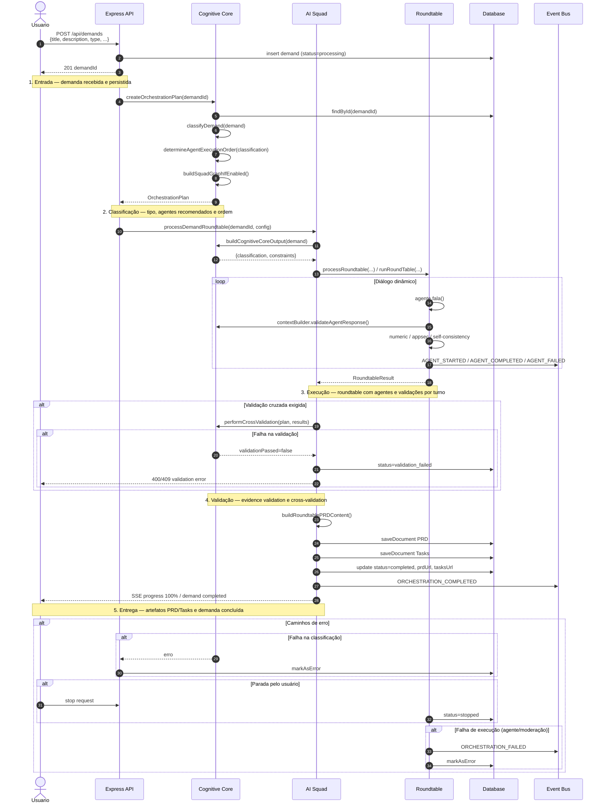

# AiChatFlow


`agentic-ai` · `rag` · `guardrails` · `multi-agent` · `observability`

AiChatFlow is an AI-assisted demand refinement platform. It receives a product, engineering, data, security, refactoring, or infrastructure demand; classifies the work; routes it through a multi-agent squad; and produces durable artifacts such as PRDs, tasks, technical notes, PDF exports, handoff bundles, and code-agent jobs.

The current stack is React 19, Vite 7, Express, TypeScript, Drizzle ORM, SQLite/Postgres, OpenRouter/OpenAI-compatible providers, RAG, LLM guardrails, Prometheus metrics, Grafana dashboards, Tempo tracing, and GitHub Actions.

> [!NOTE]
> The repository is actively evolving. Trust checked-in code, specs, evidence files, and CI scripts over stale screenshots or older architecture notes.

## What It Does

- Runs a configurable AI squad for demand discovery, refinement, risk analysis, QA, architecture, security, finance, UX, and anti-overengineering review.
- Classifies demands into canonical types such as `newFeature`, `improvement`, `bug`, `discovery`, `exploratoryAnalysis`, `security`, `refactoring`, and `infrastructure`.
- Applies evidence-aware guardrails: prompt-injection checks, cited-path validation, numeric provenance, groundedness checks, and fail-closed defaults for unavailable safety classifiers.
- Persists durable state for demands, documents, orchestration runs, document jobs, agent jobs, code-agent jobs, retention logs, costs, prompts, and audit trails.
- Supports RAG over refinement history and repository context, with optional embeddings, rerank, feedback loops, and semantic cache.
- Exposes real-time operator feedback through SSE/WebSocket flows and persisted orchestration runtime records.
- Produces handoff bundles and Spec-Kit-compatible artifacts for downstream implementation.

## Repository Map

```text
client/                 React application, pages, hooks, UI and governance components
server/                 Express API, workers, routes, services, cognitive core and guardrails
shared/                 Drizzle schemas, Zod contracts and shared TypeScript types
agents/                 YAML agent definitions and discovery template
config/                 Versioned feature flags and runtime policy files
migrations/             SQLite migrations
migrations-pg/          PostgreSQL migrations
observability/          Prometheus, Grafana and Tempo local stack
scripts/                Evaluation, RAG, prompt, audit and maintenance scripts
datasets/               Versioned few-shot datasets used by agent evaluation
knowledge/              Generic domain and product-role retrieval corpora
prompts/                Versioned system and evaluation prompts
tests/                  Unit, integration, contract, E2E and accessibility tests
docs/                   ADRs, architecture notes, baselines and operational reports
```

## Core Architecture

### Runtime

- `server/index.ts` bootstraps schema health checks, governance/idempotency schemas, document workers, retention worker, handoff subscriber, code-agent worker, stale-run reconciliation, job recovery, Redis-backed cache initialization, `/metrics`, Swagger, routes, error handling, Vite dev middleware, and static production serving.
- `server/routes/index.ts` mounts API domains for cognitive/RAG routes, governance, prompts, admin, billing, GitHub, demands, artifacts, refinements, system, orchestration runtime, model names, safety, debug audit logs, metrics, and client error reporting.
- The local development bind defaults to `127.0.0.1`; non-local bind is explicit via `HOST`/`NODE_ENV`.

### Data

- Drizzle schemas live in `shared/schema.ts` and `shared/schema-pg.ts`.
- SQLite is the default local path via `DATABASE_URL=sqlite.db`.
- Postgres/Neon is supported through `DATABASE_URL=postgresql://...`.
- The repo currently includes migrations for both SQLite and Postgres, including durable job tables.

### AI Providers

The default configuration is OpenRouter-centered, with optional OpenAI-compatible providers and native provider integrations:

- OpenRouter for primary model routing and embeddings.
- OpenAI SDK for compatible chat and embedding clients.
- Mistral, Xiaomi MiMo, NVIDIA NIM, and Bedrock hooks where configured.
- Model registry/discovery, promotion, rollback, routing evaluation, and cost-aware routing are controlled through env vars and feature flags.

## Local Setup

Requirements:

- Node.js 20+
- npm
- SQLite for local development, or Postgres/Neon for remote persistence
- At least one configured AI provider key for real LLM execution

```bash
git clone https://github.com/jhonnybrzz1/squadflow.git
cd squadflow
npm ci
cp .env.example .env
npm run db:push
```

Minimal local `.env`:

```env
DATABASE_URL=sqlite.db
STORAGE=db
PORT=5000
NODE_ENV=development

OPENROUTER_API_KEY=your_openrouter_api_key_here
OPENAI_API_KEY=your_openai_api_key_here
SESSION_SECRET=your_session_secret_here
```

Optional provider/runtime settings are documented in `.env.example`, including Mistral, Xiaomi MiMo, NVIDIA, Bedrock, Redis, OTLP tracing, RAG embeddings, rerank, model discovery, code-agent autorun, and routing budgets.

Start development:

```bash
npm run dev
```

If port `5000` is occupied:

```bash
HOST=127.0.0.1 PORT=5001 npm run dev
```

If the dev watcher hits macOS file limits (`EMFILE`), use a local production build:

```bash
npm run build
HOST=127.0.0.1 PORT=5001 NODE_ENV=production node --env-file .env dist/index.js
```

## Scripts

| Command                           | Purpose                                        |
| --------------------------------- | ---------------------------------------------- |
| `npm run dev`                     | Start Express + Vite development runtime       |
| `npm run build`                   | Build frontend and bundle backend into `dist/` |
| `npm start`                       | Run the production server from `dist/index.js` |
| `npm run check`                   | TypeScript typecheck                           |
| `npm test`                        | Run the Vitest suite                           |
| `npm run lint`                    | Run ESLint                                     |
| `npm run format`                  | Format the repository with Prettier            |
| `npm run db:push`                 | Push Drizzle schema changes                    |
| `npm run gates`                   | Run repository gate validation                 |
| `npm run test:e2e:reduced-motion` | Run the Playwright reduced-motion E2E test     |
| `npm run rag:ingest:refinements`  | Ingest refinement data for RAG                 |
| `npm run rag:embed:refinements`   | Generate refinement embeddings                 |
| `npm run audit:agents`            | Run agent output audit sampling                |
| `npm run prompts:baseline`        | Generate prompt baseline artifacts             |
| `npm run prompts:list`            | List registered prompts                        |
| `npm run prompts:test`            | Test prompt contracts                          |
| `npm run evaluate-prompt`         | Evaluate prompt quality                        |
| `npm run evaluate-agent`          | Evaluate individual agent outputs              |
| `npm run evaluate-guardrails`     | Evaluate guardrail behavior                    |
| `npm run evaluate-rag`            | Evaluate RAG retrieval                         |
| `npm run evaluate-routing`        | Evaluate model routing                         |
| `npm run classifier:f1:baseline`  | Build classifier F1 baseline                   |
| `npm run audit:production`        | Reject known production dependency risks       |
| `npm run validate:public`         | Validate an isolated public snapshot           |

## API Surface

Important mounted surfaces:

| Surface                      | Purpose                                                     |
| ---------------------------- | ----------------------------------------------------------- |
| `/api/demands`               | Demand lifecycle, documents, metadata, controls and history |
| `/api/refinements`           | Refinement workflows and generated artifacts                |
| `/api/governance`            | Approval, gating and human-review flows                     |
| `/api/prompts`               | Prompt versions, activation, A/B tests and metrics          |
| `/api/admin`                 | Operational administration and retention policy routes      |
| `/api/billing`               | Billing balance and durable cost data                       |
| `/api/safety`                | Safety and guardrail operations                             |
| `/api/orchestration-runtime` | Persisted orchestration run details                         |
| `/api/system`                | System health and operational metadata                      |
| `/debug`                     | LLM audit logs when enabled and authorized                  |
| `/admin/guardrails-logs`     | Guardrail log UI/routes                                     |
| `/metrics`                   | Prometheus metrics                                          |
| `/api-docs`                  | Swagger UI                                                  |

## Feature Flags

Versioned defaults live in `config/feature-flags.json`; local overrides can live in `config/feature-flags.overrides.json`.

Notable defaults:

- Enabled: agent router, request telemetry, task classification, hybrid classifier, LLM audit log, LLM guardrails, agent streaming, DISC personalization, prompt versioning, pgvector hooks, query intent detection, RAG feedback loop, semantic cache, LLM tracing, trace export, red team, self-consistency, context engineering, structured agent response pilot, cited-path validation, numeric provenance, semantic injection classifier and enforcement.
- Disabled by default or shadow/opt-in: parallel agents, roundtable streaming, adaptive model routing, roundtable cache, model registry/discovery scheduler, local-only RAG embeddings, and Redis-backed distributed cache unless `REDIS_URL` is configured.
- Demand-type evidence rules are defined under `demandTypeRules` for discovery, bug, exploratory analysis, new feature, improvement, security, refactoring, and infrastructure.

## Observability

The app exposes Prometheus metrics at `/metrics`. The local observability stack is under `observability/`:

```bash
docker compose -f observability/docker-compose.observability.yml up -d
```

Included assets:

- `observability/prometheus/prometheus.yml`
- `observability/prometheus/alerts.yml`
- `observability/grafana/aichatflow-overview.json`
- `observability/grafana/provisioning/`
- `observability/tempo/tempo-config.yaml`

The stack covers HTTP latency, AI call latency, time-to-first-token, token/cost metrics, classifier/routing metrics, RAG instrumentation, and trace exemplars where enabled.

## Validation

Recommended local gate before opening a PR:

```bash
npm run check
npm test
npm run lint -- --quiet
npm run build
git diff --check
```

Recent full-suite validation in this checkout passed outside the restrictive sandbox with:

```text
274 test files passed
2719 tests passed
3 skipped
```

> [!TIP]
> Some integration tests open local listeners through Supertest or WebSocket servers. In restricted sandboxes, `listen EPERM` usually means the environment blocked binding, not that the application route failed.

## CI

`.github/workflows/ci.yml` runs on pushes and pull requests to `main`/`master`, plus a nightly schedule.

Main gates:

- `npm ci`
- `npm run check`
- `node scripts/lint-budget.mjs`
- `npm run build && node scripts/bundle-budget.mjs`
- `npm test`
- model-governance regression tests
- hallucination acceptance gate
- agent eval dataset validation
- prompt-injection guardrail gate
- PRD compatibility checks
- reduced-motion Playwright E2E job

The PR smoke job also runs deterministic guardrail and routing evaluations even without provider secrets.

## Security Notes

- Do not commit `.env`, provider keys, logs with secrets, or local database dumps.
- Use fine-grained GitHub tokens with the narrowest repository permissions needed.
- Set `SESSION_SECRET` outside throwaway local experiments.
- Keep local development bound to `127.0.0.1` unless a non-local bind is intentional.
- Guardrail unavailability is treated as a fail-closed condition by default; fail-open behavior requires explicit opt-in in the relevant context.
- Redis, model discovery, code-agent autorun, and external trace export should be enabled deliberately through env/config, not assumed from installed dependencies.
- `npm run audit:production` is a publication gate. A full development-tree audit currently retains four moderate findings in the deprecated `drizzle-kit > @esbuild-kit/* > esbuild@0.18.20` chain; npm offers only an incompatible Drizzle downgrade, so re-evaluate this exception whenever Drizzle removes that chain.

## Multi-Agent Demand Orchestration

A demanda percorre um pipeline de 5 etapas. O diagrama abaixo usa Mermaid (`sequenceDiagram`) e reflete o fluxo real encontrado em `server/cognitive-core/agent-orchestrator.ts`, `server/services/ai-squad.ts` e `server/services/ai-squad/squad-coordinator.ts`.



### Inputs e outputs por etapa

| Etapa            | Input principal                                                     | Output principal                                                       | Responsável                                                                                                       |
| ---------------- | ------------------------------------------------------------------- | ---------------------------------------------------------------------- | ----------------------------------------------------------------------------------------------------------------- |
| 1. Entrada       | Payload do usuário (`title`, `description`, `type`, etc.)           | Demanda persistida com `status=processing`                             | `server/routes/demands.ts`                                                                                        |
| 2. Classificação | `Demand` (título, descrição, tipo)                                  | `DemandClassification` com `recommendedAgents` e `agentExecutionOrder` | `demandClassifier.classifyDemand` + `agentOrchestrator.createOrchestrationPlan`                                   |
| 3. Execução      | `OrchestrationPlan`, `RoundtableConfig`, contexto interno           | `RoundtableResult` com `rounds`, `consolidation`, `divergences`        | `AISquad.processDemandRoundtable` → `SquadCoordinator.processRoundtable` → `RoundtableOrchestrator.runRoundTable` |
| 4. Validação     | Respostas brutas de cada agente, evidence blocks, regras de domínio | Resposta limpa, score de validação, evidence registrada                | `contextBuilder.validateAgentResponse` (por turno) e `performCrossValidation` (se habilitada)                     |
| 5. Entrega       | Resultado consolidado do roundtable                                 | Documentos `PRD` e `Tasks` salvos, demanda `completed`                 | `AISquad.saveDocument` + `demandRepository.update`                                                                |

### Glossário

- **Classificação**: mapeamento da demanda para um tipo canônico (`newFeature`, `improvement`, `bug`, `discovery`, etc.) e seleção dos agentes recomendados. Implementada em `demand-classifier.ts`.
- **Execução**: diálogo multi-agente (roundtable) onde cada agente contribui, um moderador seleciona o próximo orador e validações por turno são aplicadas. Implementada em `roundtable-orchestrator.ts`.
- **Validação**: verificação da resposta de cada agente (`contextBuilder.validateAgentResponse`) e, opcionalmente, validação cruzada entre agentes (`performCrossValidation`).
- **Entrega**: geração e persistência dos artefatos `PRD` e `Tasks`, atualização do status da demanda para `completed` e notificação via SSE.
- **Orquestração**: coordenação das etapas acima, do plano cognitivo até a entrega, publicando eventos de ciclo de vida no `eventBus` para auditoria (`orchestration-runtime-subscriber.ts`).

### Validação do PM

(a) **É possível identificar em qual etapa uma demanda falhou apenas com os logs atuais?**
Sim, parcialmente. Os logs de `agent-orchestrator.ts` e `roundtable-orchestrator.ts` incluem o campo `step` (`execution_start`, `agent_complete`, `agent_error`, `execution_failed`, `execution_complete`) e `event` (`ORCHESTRATION_STARTED`, `ORCHESTRATION_COMPLETED`, `ORCHESTRATION_FAILED`, `AGENT_FAILED`). Além disso, `orchestration-runtime-subscriber.ts` persiste esses eventos em `orchestration_events`, permitindo consulta por `demandId`/`runId`. O que ainda não é estruturado: a etapa exata dentro do `roundtable` (ex.: qual turno falhou por qual motivo) e correlação automática entre log e demanda sem `runId`. Isso seria melhorado pela Feature B-2b (logs estruturados por etapa), se priorizada.

(b) **Quanto tempo um dev júnior leva para rodar uma demanda ponta a ponta sem ajuda?**
A MEDIR — sem baseline. Não há métrica de onboarding coletada no repositório. Para obter o baseline, recomenda-se um survey de 30 min com 3 devs juniores medindo tempo até o primeiro `ORCHESTRATION_COMPLETED` local.

## Curated Public Snapshot

This working repository contains internal planning and generated artifacts that
must not be copied into a public repository. Build a public candidate only from
the versioned allowlist:

```bash
./scripts/export-public-repo.sh /absolute/path/AiChatFlow1-public
```

The destination must not exist. The exporter reads committed content from
`HEAD`, rejects sensitive filenames and symbolic links, excludes internal
workspace directories, and runs Gitleaks before succeeding. An optional second
argument selects another commit or tree:

```bash
./scripts/export-public-repo.sh /absolute/path/AiChatFlow1-public <git-ref>
```

The resulting directory intentionally has no `.git` history. A clean public
repository must be initialized separately after all release gates pass.
Removing a credential from the snapshot does not revoke it at its provider.

Run the complete isolated gate with Node 20 before publishing:

```bash
npm run validate:public
```

This command exports committed content into a temporary directory, initializes
only temporary Git metadata, installs from the lockfile, provisions a fresh
SQLite database from the Drizzle schema, verifies the required tables, rejects
moderate-or-higher production dependency advisories, and runs typecheck,
production build, and the full Vitest suite. The temporary directory is removed
when the command exits.

## Project Documentation

- ADRs: `docs/adr/`
- Observability guide: `observability/README.md`
- Threat model: `docs/threat-model.md`
- OpenAPI/Swagger setup: `server/swagger.ts` and `/api-docs`
