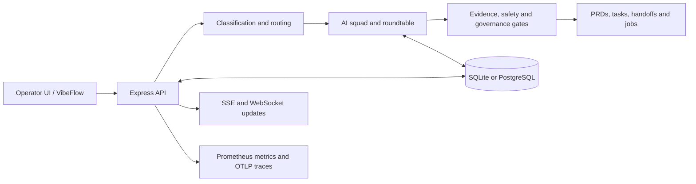

<div align="center">

# SquadFlow

**AI-assisted demand refinement with a governed multi-agent squad.**

[](https://github.com/jhonnybrzz1/squadflow/actions/workflows/public-snapshot.yml)
[](https://github.com/jhonnybrzz1/squadflow/actions/workflows/secret-scan.yml)
[](.node-version)
[](https://www.typescriptlang.org/)
[](LICENSE)

[Overview](#overview) · [Capabilities](#capabilities) · [Architecture](#architecture) · [Getting started](#getting-started) · [Configuration](#configuration) · [Documentation](#documentation)

</div>

## Overview

SquadFlow is the public codebase for an AI-assisted product and engineering workflow. It turns an unstructured demand into traceable artifacts by classifying the work, selecting specialist agents, running a moderated roundtable, applying evidence and safety gates, and persisting the result.

The repository contains two complementary product surfaces:

- **AiChatFlow** — the local-first operator workspace for demand intake, multi-agent orchestration, governance, audit trails, evaluations, and downstream handoffs.
- **VibeFlow** — a beta self-service experience under `/vibe` with account flows, usage controls, optional read-only GitHub context, repository previews, database-schema context, and subscription hooks.

> [!NOTE]
> This project is under active development. Treat checked-in code, tests, configuration, and CI as the source of truth; older screenshots and generated planning artifacts may describe previous behavior.

> [!IMPORTANT]
> Real refinements call external model providers and may incur cost. Review model, budget, cache, and tracing settings in `.env.example` before enabling them.

## Capabilities

- **Demand refinement** — handles product, engineering, data, security, refactoring, discovery, and infrastructure work.
- **Multi-agent orchestration** — coordinates configurable product, architecture, engineering, QA, security, UX, data, finance, and anti-overengineering roles.
- **Evidence-aware generation** — validates cited repository paths, numeric provenance, prompt-injection signals, and demand-specific evidence rules.
- **Durable delivery** — persists demands, documents, orchestration events, jobs, prompts, costs, feedback, retention data, and audit records.
- **Artifact production** — generates PRDs, task plans, technical notes, PDF documents, Spec-Kit handoffs, and code-agent jobs.
- **Repository and data context** — supports RAG, refinement history, optional embeddings/reranking, semantic caching, read-only GitHub context, and opt-in database-schema context.
- **Governance and recovery** — includes approval gates, human-review states, dead-letter handling, idempotency, startup recovery, and stale-run reconciliation.
- **Observability** — exposes Prometheus metrics and supports Grafana dashboards, Tempo traces, structured logs, token/cost telemetry, and LLM audit records.

## Architecture



The runtime is a single Node.js service: Express exposes the API and production assets, while Vite serves the React application during development. Drizzle selects SQLite for the default local setup or PostgreSQL/Neon when configured.

### Technology

| Layer      | Stack                                                                                   |
| ---------- | --------------------------------------------------------------------------------------- |
| Web        | React 19, Vite 7, Wouter, TanStack Query, Tailwind CSS 3                                |
| API        | Node.js 20, Express 4, TypeScript, Zod, WebSocket/SSE                                   |
| Data       | Drizzle ORM, SQLite, PostgreSQL/Neon, optional Redis cache                              |
| AI         | OpenRouter/OpenAI-compatible clients, configurable provider adapters, RAG and reranking |
| Quality    | Vitest, Playwright, Testing Library, ESLint, Prettier, Gitleaks                         |
| Operations | Prometheus, Grafana, Tempo, OpenTelemetry-compatible export, GitHub Actions             |

### Main surfaces

| Path                         | Purpose                                        |
| ---------------------------- | ---------------------------------------------- |
| `/`                          | Local operator workspace and demand workflow   |
| `/vibe`                      | Beta self-service refinement experience        |
| `/api/demands`               | Demand lifecycle and generated documents       |
| `/api/refinements`           | Refinement flows used by the platform surfaces |
| `/api/governance`            | Approval, evidence, and human-review controls  |
| `/api/orchestration-runtime` | Persisted orchestration runs and events        |
| `/api-docs`                  | Swagger UI generated from the API registry     |
| `/metrics`                   | Prometheus metrics                             |

## Getting started

### Prerequisites

- Node.js 20, matching [`.node-version`](.node-version)
- npm
- Git
- At least one supported model-provider key for real AI execution

SQLite is the default local database, so no separate database server is required for the basic setup.

### Install and run

```bash
git clone https://github.com/jhonnybrzz1/squadflow.git
cd squadflow
npm ci
cp .env.example .env
npm run db:push
npm run dev
```

Open <http://127.0.0.1:5000>.

For the smallest useful local configuration, edit `.env` and set a real provider key:

```env
DATABASE_URL=sqlite.db
STORAGE=db
PORT=5000
OPENROUTER_API_KEY=<your-openrouter-key>
```

If port `5000` is occupied:

```bash
HOST=127.0.0.1 PORT=5001 npm run dev
```

If a development watcher reaches the macOS file limit, run the built server instead:

```bash
npm run build
HOST=127.0.0.1 PORT=5001 npm start
```

## Configuration

The complete, commented configuration reference is [`.env.example`](.env.example). Common settings include:

| Variable                                              | Use                                                              |
| ----------------------------------------------------- | ---------------------------------------------------------------- |
| `DATABASE_URL`                                        | `sqlite.db` locally or a PostgreSQL/Neon connection string       |
| `STORAGE`                                             | Durable database storage (`db`) or explicit volatile memory mode |
| `PORT` / `HOST`                                       | HTTP bind configuration; local development defaults to loopback  |
| `OPENROUTER_API_KEY`                                  | Primary OpenRouter-backed model access                           |
| `OPENAI_API_KEY`, `MISTRAL_API_KEY`, `XIAOMI_API_KEY` | Optional provider integrations                                   |
| `ADMIN_API_KEY`                                       | Protects administrative routes when binding beyond loopback      |
| `REDIS_URL`                                           | Optional distributed backing store for supported caches          |
| `OTEL_EXPORTER_OTLP_ENDPOINT`                         | Optional trace export destination                                |

The beta `/vibe` surface additionally requires strong `JWT_SECRET` and `GIT_TOKEN_SECRET` values. GitHub OAuth and Paddle are opt-in and require their corresponding variables from `.env.example`.

> [!WARNING]
> This is a local-first application with no authentication layer: the request context is a fixed local administrator and the role guards are pass-throughs. `npm start` sets `NODE_ENV=production`, and the default host in that mode is `0.0.0.0` — set `HOST=127.0.0.1` explicitly, or front the service with an authenticating proxy. Administrative prefixes additionally require `ADMIN_API_KEY` on non-loopback binds, but that is damage control, not an authorization model. Replace every secret from `.env.example` before exposing anything: those values are published in this repository and are rejected at startup for that reason. See [the threat model](docs/threat-model.md).

## Commands

| Command                    | Purpose                                                    |
| -------------------------- | ---------------------------------------------------------- |
| `npm run dev`              | Start the Express and Vite development runtime             |
| `npm run build`            | Build the React app and bundle the server                  |
| `npm start`                | Run the production bundle from `dist/`                     |
| `npm run typecheck`        | Run TypeScript without emitting files                      |
| `npm test`                 | Run the complete Vitest suite                              |
| `npm run lint`             | Run ESLint                                                 |
| `npm run format`           | Format supported files with Prettier                       |
| `npm run db:push`          | Apply the Drizzle schema to the configured database        |
| `npm run audit:production` | Reject moderate-or-higher production dependency advisories |
| `npm run validate:public`  | Validate an isolated public candidate end to end           |

Evaluation and maintenance commands for RAG, routing, prompts, agents, and classifiers are available in [`package.json`](package.json).

## Project layout

```text
client/          React application, operator UI and VibeFlow pages
server/          Express routes, orchestration, workers, guardrails and providers
shared/          Drizzle schemas, Zod contracts and shared TypeScript types
agents/          Versioned agent definitions and templates
config/          Feature flags and runtime policies
migrations/      SQLite migrations
migrations-pg/   PostgreSQL migrations
observability/   Prometheus, Grafana and Tempo assets
scripts/         Validation, evaluation, export and maintenance commands
tests/           Unit, integration, contract, E2E and accessibility coverage
docs/            Architecture decisions, baselines and operational guidance
```

## Quality and security

Every push and pull request to `main` runs two protected workflows:

- **Public Snapshot CI** — clean install, production dependency audit, fresh SQLite schema, typecheck, production build, and the complete Vitest suite.
- **Secret Scan** — full-history Gitleaks scan with credentials disabled during checkout persistence.

Recommended local gate:

```bash
npm run typecheck
npm run audit:production
npm run build
npm test
git diff --check
```

Security-relevant behavior includes fail-closed access to administrative prefixes on non-loopback binds, per-IP rate limits on model-triggering endpoints, AES-256-GCM encryption for stored Git and database credentials, signed OAuth state, security headers, bounded repository reads, and layered prompt-injection defenses. Redis caching is opt-in through `REDIS_URL`. Trace export is enabled by default and points at `http://localhost:4318`, so review `OTEL_EXPORTER_OTLP_ENDPOINT` before pointing it at a collector you do not control. The application has no user authentication — read [the threat model](docs/threat-model.md) before deploying it anywhere but localhost.

Report vulnerabilities through GitHub private vulnerability reporting as described in [`SECURITY.md`](SECURITY.md). Never put credentials or exploit details in a public issue.

## Documentation

- [Orchestration architecture](docs/architecture/orchestration.md)
- [RAG architecture](docs/architecture/rag.md)
- [Model governance](docs/architecture/model-governance.md)
- [Feature flags](docs/feature-flags.md)
- [Observability guide](observability/README.md)
- [Threat model](docs/threat-model.md)
