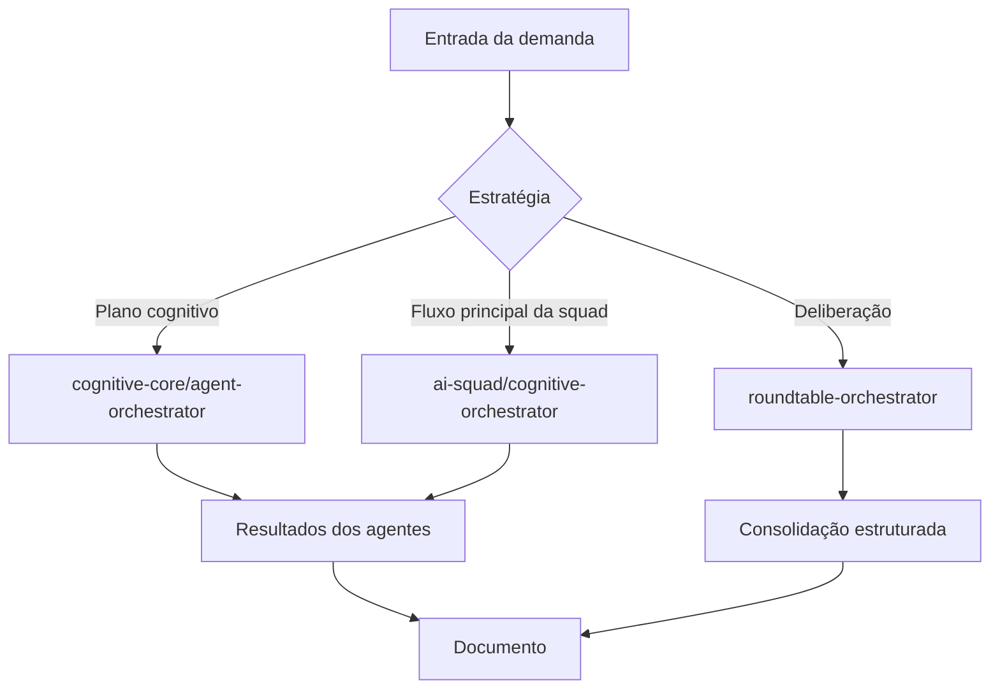

# Arquitetura de orquestração

Há três caminhos ativos. A antiga `SquadOrchestrator` era apenas uma subclasse vazia e foi removida; `SquadCoordinator` é usado diretamente.

| Caminho                                | Quando usar                                  | Característica                                         |
| -------------------------------------- | -------------------------------------------- | ------------------------------------------------------ |
| `cognitive-core/agent-orchestrator.ts` | Execução de plano classificado em estágios   | Coordena plano e dependências cognitivas               |
| `ai-squad/cognitive-orchestrator.ts`   | Pipeline principal de refinamento e geração  | Evolui contexto, executa agentes e produz documentos   |
| `ai-squad/roundtable-orchestrator.ts`  | Demandas que exigem deliberação entre papéis | Diálogo, divergências, consolidação e Red-Team gateado |

## Invariantes

- O nível de refinamento controla custo e profundidade.
- Nível 3 mantém deliberação sequencial; níveis 1–2 podem usar primeiro ciclo paralelo atrás de flag.
- Falhas parciais devem preservar resultados válidos e registrar agentes com erro.
- Persistência e eventos SSE seguem a ordem lógica, mesmo quando chamadas são paralelas.
