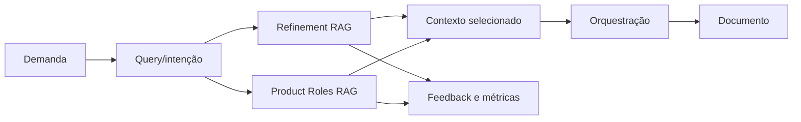

# Arquitetura RAG

Os módulos relacionados a RAG não são todos pipelines de recuperação. Alguns são políticas, telemetria ou componentes ainda dormentes.

| Módulo                               | Papel                                          | Estado                                                                 |
| ------------------------------------ | ---------------------------------------------- | ---------------------------------------------------------------------- |
| `product-roles-rag.ts`               | Recupera metodologias e conhecimento por papel | Ativo                                                                  |
| `refinement-rag.ts`                  | Recupera refinamentos e decisões anteriores    | Ativo                                                                  |
| `rag-feedback.ts`                    | Registra feedback sobre resultados recuperados | Telemetria/feedback                                                    |
| `rag-substep-metrics.ts`             | Mede subetapas de recuperação                  | Telemetria                                                             |
| `rag-storage-policy.ts`              | Define política de armazenamento               | Política                                                               |
| `semantic-chunker.ts`                | Chunking semântico/hierárquico                 | Dormente no runtime, preservado por possuir contrato e testes próprios |
| `ai-squad/cognitive-orchestrator.ts` | Consome contexto recuperado no fluxo cognitivo | Integração/orquestração                                                |

Não integrar nem remover o `semantic-chunker` apenas por contagem de referências. A decisão deve comparar qualidade de recuperação, custo de ingestão e compatibilidade com o armazenamento atual.
