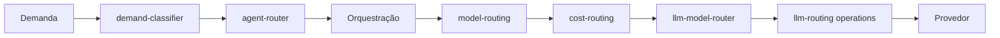

# Arquitetura de roteamento

O sistema possui camadas de roteamento distintas porque elas respondem a perguntas diferentes. Esta separação deve ser preservada até que métricas e evals comprovem que uma fusão não altera comportamento.

## Fluxo

## Responsabilidades

| Camada                 | Decisão                                                | Não deve decidir               |
| ---------------------- | ------------------------------------------------------ | ------------------------------ |
| `demand-classifier.ts` | Tipo, intensidade e sinais da demanda                  | Provedor ou modelo final       |
| `agent-router.ts`      | Quais papéis/agentes participam                        | Modelo de inferência           |
| `model-routing.ts`     | Modelo NANO/MINI por estágio e política adaptativa     | Normalização do ID do provedor |
| `cost-routing.ts`      | Restrição por custo, safe model e kill switch          | Composição de prompts          |
| `llm-model-router.ts`  | Modelo por `taskType`, aliases, capacidades e provedor | Seleção de agentes             |
| `llm-routing.ts`       | Fachada pública das operações e fallbacks              | Política de produto            |

## Regras de alteração

- Mudanças em modelo efetivo exigem testes de governança e eval de prompt.
- Uma camada deve registrar a razão da decisão, sem reclassificar decisões anteriores silenciosamente.
- A fusão de `cost-routing` e `model-routing` só deve ocorrer após inventário de callers e comparação shadow.
- `agent-router` e `demand-classifier` são complementares: um descreve a demanda; o outro seleciona participantes.
